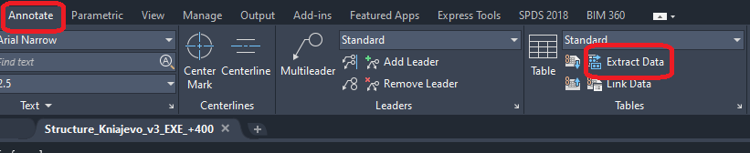

# autocad-to-excel-automation
Python tool that converts .xls file data exported from AutoCAD exports into structured Excel files for engineering workflows. Reads marks on a rebar and calculates its weight.
# AutoCAD to Excel Automation Tool

##  Overview
This project automates the extraction of .xls file data from AutoCAD drawings and converts it into structured Excel files for engineering workflows.

##  Problem
Manual counting rebars on the drawing and calculating their count and the weight, which have to be present on each drawing as a table:
- Time-consuming
- Error-prone
- Inefficient for large projects

##  Solution
A Python-based tool that:
- Reads exported AutoCAD .xls file data
- Processes and structures it
- Outputs clean Excel files ready for engineering use or adding to the drawings

##  Technologies
- Python
- Pandas
- OpenPyXL

## ▶️ How to Use

1. From the Annotate menu in AutoCAD select Extract data

2. Then slect the objects from whitch you want to extract information.
3. Choose the objects(Text) and the their Value to be exported.
2. Place the exported .xls file in `example_input/`
3. Run:

```bash
python Autocad_to_Excel.ipynb
